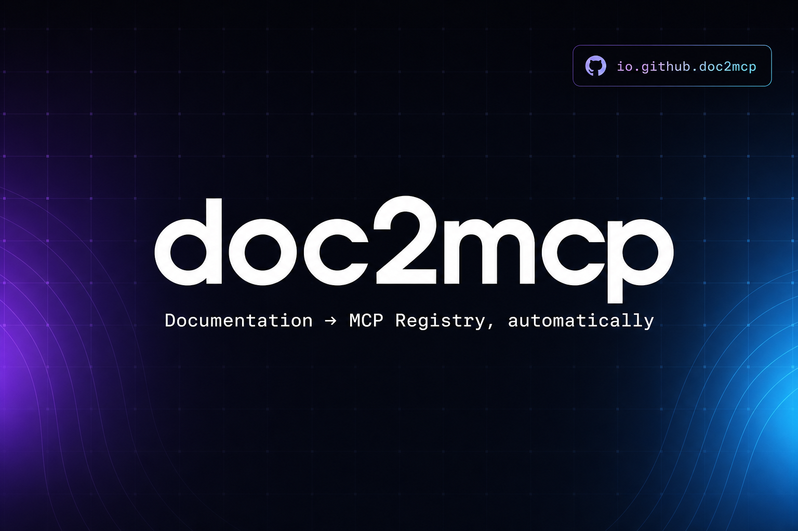

<div align="center">

# doc2mcp

### Documentation infrastructure for AI agents

**Paste any docs URL → get a hosted, Cursor-ready MCP server in under 60 seconds.**

No install. No local clone. No API keys to hand over.



[**Live**](https://doc2mcp.site) · [Docs](https://doc2mcp.site/docs) · [Pricing](https://doc2mcp.site/pricing) · [Comparison](https://doc2mcp.site/comparison)

[](https://github.com/garvitsingh006/doc2mcp/stargazers)
[](https://nextjs.org)
[](https://ai.google.dev)
[](https://modelcontextprotocol.io)
[](https://registry.modelcontextprotocol.io/?search=doc2mcp)
[](https://www.npmjs.com/package/doc2mcp)
[](https://github.com/garvitsingh006/doc2mcp/pulls)
[](#license)
[](https://docs.github.com/en/apps/oauth-apps)

**If doc2mcp is useful to you, please [⭐ star the repo](https://github.com/garvitsingh006/doc2mcp) — it helps other developers find it.**

</div>

---

> **Private codebase.** This repository contains proprietary product code.
> It is not open source. For public docs, badges, and MCP Registry publishing,
> see **[doc2mcp/doc2mcp-registry](https://github.com/doc2mcp/doc2mcp-registry)**.

## Product

- **Site:** [doc2mcp.site](https://doc2mcp.site)
- **CLI:** `npm install -g doc2mcp`
- **Registry:** every converted MCP auto-publishes to `io.github.doc2mcp/<slug>` on the [official MCP Registry](https://registry.modelcontextprotocol.io/?search=doc2mcp) when `MCP_REGISTRY_GITHUB_TOKEN` is configured in production.

## How it works

1. Paste a docs URL — LangChain, Stripe, your own — in the chat with the
   **doc2mcp** toggle on.
2. The pipeline crawls the site (Mintlify, Docusaurus, OpenAPI JSON/YAML,
   GitHub repos, GitBook, plain HTML), preserving code blocks and chunking by
   heading.
3. You get a remote MCP URL + Bearer token. Paste it into Cursor's `mcp.json`
   and reload.
4. Every generated MCP is **auto-published to the official MCP Registry** under
   `io.github.doc2mcp/<slug>` and listed in the marketplace.

> **Auth:** Sign in with GitHub OAuth — no passwords, no Google account required.

```json
{
  "mcpServers": {
    "stripe": {
      "url": "https://doc2mcp.site/api/mcp/<projectId>/mcp",
      "headers": {
        "Authorization": "Bearer <project-token>"
      }
    }
  }
}
```

## CLI

[](https://www.npmjs.com/package/doc2mcp)
[](https://www.npmjs.com/package/doc2mcp)

Install the terminal client and run the same conversion pipeline from your shell:

```bash
npm install -g doc2mcp   # global install puts `doc2mcp` on your PATH
doc2mcp login            # browser-based device auth
doc2mcp https://docs.example.com
```

> Use `-g`. A local `npm i doc2mcp` won't expose the `doc2mcp` command — use `npx doc2mcp <url>` instead.

The CLI uses browser-based device auth, shares your web account limits, auto-lists
ready MCPs in the marketplace, and can write configs to Cursor, VS Code, Claude
Desktop, and Windsurf.

- 📦 npm: https://www.npmjs.com/package/doc2mcp
- 📖 Full command reference: [`cli/README.md`](./cli/README.md) · [docs/cli](https://doc2mcp.site/docs/cli)

## MCP tools

| Tool | What it does |
|------|--------------|
| `list_documentation_pages` | Every crawled page |
| `get_documentation_page` | Full markdown of one page |
| `search_documentation` | Heading-aware search |
| `get_documentation_overview` | Summary + index |
| `read_full_documentation` | All pages combined |
| `ask_documentation` | Q&A with citations |

## Stack

Next.js 16 · Google Gemini · Supabase · Upstash Redis + QStash · Streamable HTTP MCP

## Internal development

For team members with repo access:

```bash
git clone https://github.com/garvitsingh006/doc2mcp.git
cd doc2mcp
pnpm install
cp .env.example .env.local
# fill GEMINI_API_KEY, AUTH_SECRET, POSTGRES_URL, Supabase keys, GitHub OAuth
pnpm db:migrate
pnpm dev
```

Open <http://localhost:3000>.

### Environment variables

```env
# Core
AUTH_SECRET=...                 # openssl rand -base64 32
GEMINI_API_KEY=...              # https://aistudio.google.com/apikey

# Supabase
NEXT_PUBLIC_SUPABASE_URL=...
NEXT_PUBLIC_SUPABASE_ANON_KEY=...
SUPABASE_SERVICE_ROLE_KEY=...
POSTGRES_URL=...                # Supabase pooler URI

# GitHub OAuth (login/signup)
# Create at https://github.com/settings/developers → OAuth Apps
# Callback URL: https://<your-project>.supabase.co/auth/v1/callback
GITHUB_CLIENT_ID=...
GITHUB_CLIENT_SECRET=...

# Admin access (comma-separated emails)
ADMIN_EMAILS=you@example.com

# MCP Registry auto-publish (optional — no-op if unset)
MCP_REGISTRY_GITHUB_TOKEN=...   # token for a member of the doc2mcp GitHub org

# Optional — improves crawl quality for SPA / sparse docs
TAVILY_API_KEY=
BRAVE_SEARCH_API_KEY=
EXA_API_KEY=
JINA_API_KEY=
FIRECRAWL_API_KEY=
```

> **Never commit secrets.** All keys above belong in `.env.local` (gitignored)
> or your host's environment settings.

## Deploy to Vercel

1. Fork / clone this repo, push to your GitHub.
2. Import the repo at <https://vercel.com/new>.
3. Add the env vars above in **Settings → Environment Variables**.
4. Deploy. doc2mcp runs on Vercel Functions out of the box.

Set `NEXT_PUBLIC_APP_URL` to your deployed domain so generated MCP configs
point at the right host. Leave it **unset on Preview** so per-branch preview
URLs resolve correctly for auth.

## Stack

| | |
|---|---|
| Framework | Next.js 16, React 19, Turbopack |
| AI | Google Gemini (`gemini-2.5-flash` by default) |
| Database | Supabase Postgres |
| Auth | Supabase Auth (GitHub OAuth) |
| UI | Tailwind v4, shadcn/ui, Framer Motion, Streamdown |
| Lint | Ultracite (Biome) |
| MCP | `@modelcontextprotocol/sdk` + official MCP Registry |

## CI / CD

A single GitHub Actions workflow ([.github/workflows/ci.yml](.github/workflows/ci.yml))
runs on every push and PR:

- TypeScript type-check (`tsc --noEmit --skipLibCheck`)
- Ultracite / Biome lint (`pnpm check`)
- Next.js production build (`pnpm exec next build`)

Branching: feature branches cut from `staging` → PR → `staging` preview for QA
→ `main` → tagged release to production. Preview deploys are created per branch
and support full login.

## Contributing

Contributions are welcome! Whether it's a bug fix, a new source-format adapter,
or docs improvements:

1. Fork the repo and create a branch off `staging`.
2. Run `pnpm check` and `pnpm exec tsc --noEmit` before opening a PR.
3. Open a PR against `staging` with a clear description.

Found a bug or have an idea? [Open an issue](https://github.com/garvitsingh006/doc2mcp/issues).

## Security

Never commit secrets — all API keys belong in `.env.local` (gitignored) or your
host's environment settings. If you discover a security issue, please open a
[private security advisory](https://github.com/garvitsingh006/doc2mcp/security/advisories/new)
instead of a public issue.

## License

[Apache 2.0](./LICENSE)

---

<div align="center">

**Built for developers shipping AI agents.** If this saved you time, [⭐ star the repo](https://github.com/garvitsingh006/doc2mcp).

</div>
